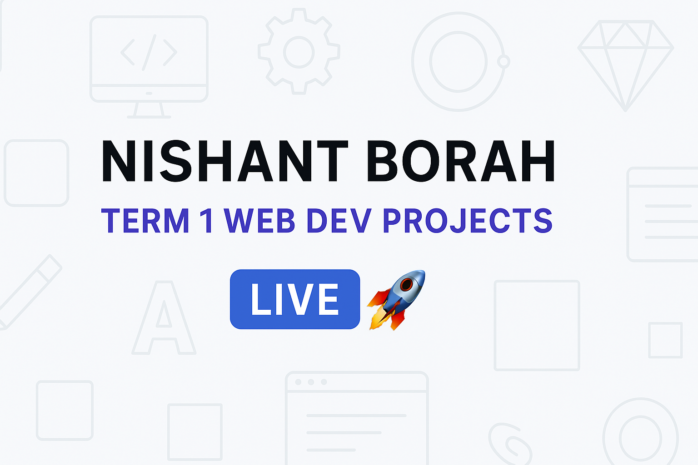

# 🌐 My Term 1 Web Development Assignments  

> A collection of my Term 1 HTML & CSS assignments — built at **Scaler School of Technology (SST)**, showcasing core concepts of modern web design and animation.

---

## 📁 Total Projects
🧩 **15 Assignments + 1 Main Index Page**

| # | File Name | Description |
|:-:|:------------|:-------------|
| 1 | **about_me.html** | A semantic web page built using `<header>`, `<main>`, `<section>`, and `<footer>`. |
| 2 | **circle.html** | Animated circle demonstrating shape creation and keyframes. |
| 3 | **contact_form.html** | Interactive contact form using HTML form elements and CSS styling. |
| 4 | **diamond.html** | CSS transform exercise to create a diamond shape. |
| 5 | **dog-gallery.html** | Responsive dog image gallery using CSS Grid. |
| 6 | **ferris-wheel.html** | Ferris-wheel animation using CSS keyframes and transforms. |
| 7 | **firstpage.html** | My very first HTML practice page. |
| 8 | **index.html** | Main hub page linking all assignments together. |
| 9 | **moon-orbit.html** | Planet–moon orbit animation using CSS keyframes. |
| 10 | **movie_collection.html** | Movie collection layout demonstrating flex and grid usage. |
| 11 | **profilecard.html** | Responsive profile card built with CSS Flexbox and Grid. |
| 12 | **recipe.html** | Recipe page built with semantic HTML and clean CSS layout. |
| 13 | **rectangle.html** | Shape-creation practice — CSS-based rectangle. |
| 14 | **square.html** | Shape-creation practice — CSS-based square. |
| 15 | **triangle.html** | CSS triangle using borders. |
| 16 | **weekend_plans.html** | Simple webpage layout for planning weekend activities. |

---

## 🧠 Concepts Covered
- Semantic HTML structure (`header`, `main`, `section`, `article`, `footer`)  
- CSS Grid and Flexbox layouts  
- Responsive design and media queries  
- CSS animations and keyframes  
- Forms and input styling  
- Transitions and hover effects  
- Shape design using pure CSS  

---

## 🚀 Live Website
Access all assignments in one place here:  
👉 **[My Web-Dev Assignments Hub](https://nishant-chilled.github.io/Nishant_Borah-/)**

---

## 👨‍💻 Author
**Nishant Borah**  
*Scaler School of Technology (SST) – Term 1 Web Development*

